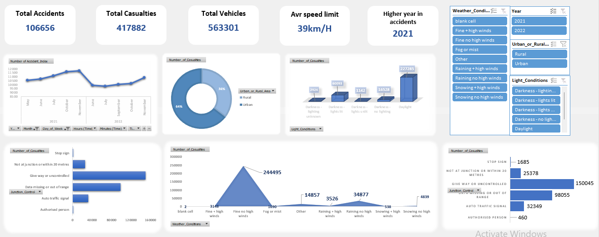
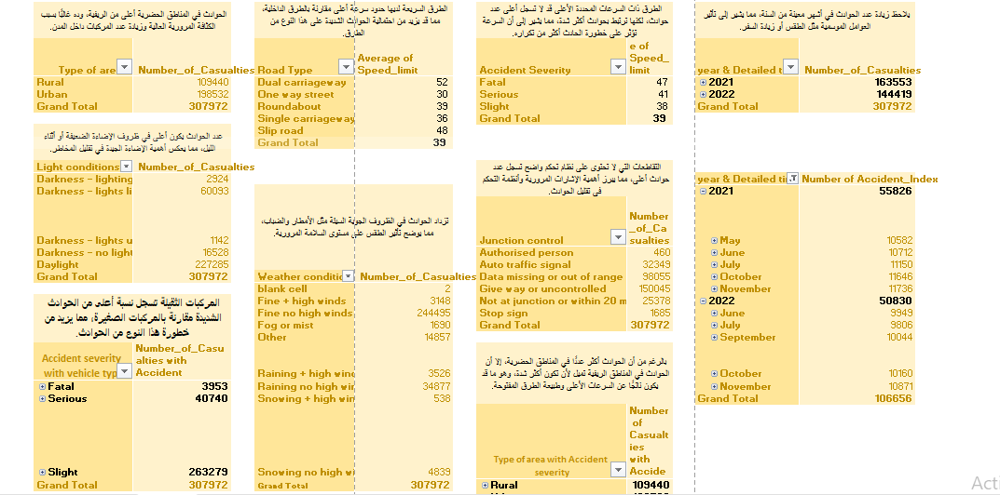
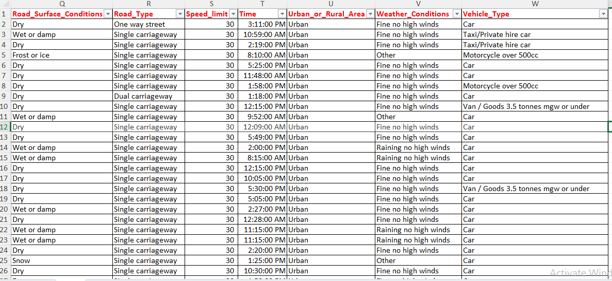

# 🚗 Road Accidents Insights & Interactive KPI Dashboard

An end-to-end data analytics and business intelligence project built entirely in Microsoft Excel. This solution transforms massive, raw traffic accident records into a structured data asset and an interactive executive dashboard designed to help transport authorities analyze patterns, evaluate environmental factors, and improve road safety metrics.

---

## 📊 Project Pipeline & Visual Previews
*The complete lifecycle of the project, from raw unstructured rows to advanced business reporting:*

### 1️⃣ Dynamic Executive Dashboard
Features high-level strategic KPIs showing total scope (106.6K Accidents, 417.8K Casualties, 563.3K Vehicles) integrated with specialized slicing parameters for complex cross-tabulation.

---

### 2️⃣ Structured Analytical Layer (Pivot Tables & Insights)
The engine behind the dashboard—utilizing optimized Pivot Tables to categorize complex combinations like Light Conditions, Weather, and Area Types alongside localized behavioral notes.

---

### 3️⃣ Raw Data Warehouse Layer
The cleaned, sanitized source transactional records from which all historical indicators and metrics are programmatically derived.

---

## 🛠️ Data Engineering & Features
* **ETL & Data Sanitization:** Executed deep cleaning operations on over 100K data rows—handling missing values, structuring temporal fields, and mapping dimensions (e.g., Road Surface, Vehicle Type, Urban vs. Rural).
* **Analytical Engine:** Built out advanced, specialized Pivot Tables to evaluate conditional metrics (e.g., Accident Severity vs. Vehicle Type, Average Speed Limit across Road Types).
* **Dynamic UI/UX Design:** Formulated a highly responsive user matrix featuring integrated Slicers for **Weather Conditions**, **Year (2021-2022)**, **Urban/Rural Area**, and **Light Conditions** to yield immediate real-time filtering.
* **Advanced Charting:** Leveraged synchronized Trend Lines, Pie/Donut distributions, Area variations, and customized Horizontal Bar Charts to maintain visual clarity.

---

## 📂 Repository Contents
* 📈 [Accidents_Analysis_Dashboard.xlsx](https://docs.google.com/spreadsheets/d/1eoRImHN0cQv1fgdVrFTH27Ao_gJyweU8/edit?usp=drive_link&ouid=108309553984817112672&rtpof=true&sd=true) - The core Microsoft Excel workbook (Hosted on Google Drive due to GitHub file size limits).
* 🖼️ **Visual Assets** - Strategic high-fidelity previews embedded directly within the pipeline (`Dashboard.png`, `Report.png`, `Raw_Data.png`).
* 📝 `README.md` - Technical project documentation.

---
*Generated as part of my Advanced Data Analytics portfolio.*
